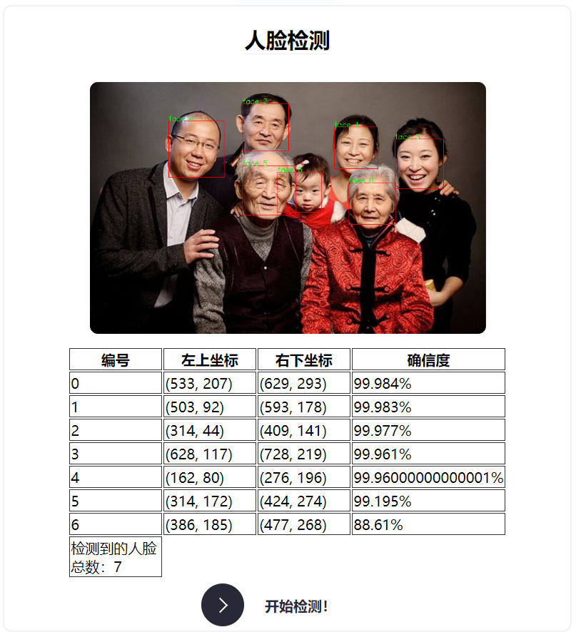

# 基于blazeface_1000e和face_landmark的人脸检测

| **姓名** | 王紫萁      | **专业** | 计算机科学与技术系 |
| :------: | :---------- | :------: | ------------------ |
| **学校** | 南京大学    | **学号** | 201220154          |
| **电话** | 18995126353 | **邮箱** | 972282146@qq.com   |

## 1. 人脸检测

### 1.1. 模型加载initDet

​	我们使用基于`WebGL`和`opencv`的前端模型框架`WebAI`导入`blazeface_1000e`模型。一个可以被正常加载的模型由两个文件组成

* `modle.onnx`：模型二进制文件
* `config.json`：模型配置文件，包括预配置的训练参数信息

在`initDet`中，我们为模型配置文件和模型二进制文件指定路径，并初始化一个模型

```js
window.model = new WebAI.Det(modelURL, modelConfig);
```

### 1.2. 检测函数detect


​	用户可以将图片上传到`imgDom`的节点下，通过`cv.imread`将html下的图片转换成能够被模型处理的RGB图片并通过异步调用`let bboxes = await model.infer(imgRGBA);`得到人脸框数据`bboxes`。该数据结构包含每张人脸框的左上和右下坐标，并且包含每张人脸的置信度。根据该数据结构我们就可以绘制出人脸框并编号，同时在表格中列出每张人脸的置信度数值。绘制过程如下：

```js
for (let i = 0, len = bboxes.length; i < len; i++) {
        let point1 = new cv.Point(bboxes[i]['x1'], bboxes[i]['y1']);
        let point2 = new cv.Point(bboxes[i]['x2'], bboxes[i]['y2']);
        cv.rectangle(imgShow, point1, point2, [255, 0, 0, 255]);
        cv.putText(imgShow, `face ${i}`, point1, 0, 0.5, [0, 255, 0, 255], 1.5, 8);
}
```

生成结果表格的过程涉及到html的插入再次不再赘述

## 2. 关键点标记

### 2.1. 数据准备和双语言通信

​	在本节中，我们使用`python`和`typescript`实现`face landmark`模型的载入与标记（在之后的综合检测中会给出纯typescript的实现方案）。为了实现语言见通信，我们使用`eel.py`库，首先，前端代码需要能够得到后端代码训练得到的结果，后端代码需要通过`url`获得前端用户上传的图片。

​	我们需要为前端代码准备一个后端的入口函数

```python
@eel.expose
def landmark_entry(imgPath: str):
    print("process in landmark")
    return keyPointDetection(imgPath)
```

该函数会将`face_landmark`的训练结果（训练结果图片地址）给到前端代码，在前端通过异步方式进入`entry`

```js
let res_img = await eel.landmark_entry(downloadLink)();
```

其中`keyPointDetection`首先读取图片并载入模型，执行模型的训练将结果返回到`result`中

```python
from urllib.request import urlretrieve
    urlretrieve(imgPath, './input/srcImg.png')
    src_img = cv2.imread("./input/srcImg.png")
    # print(imgPath)
    # 加载模型并进行预测
    module = hub.Module(name="face_landmark_localization")	
    #在此使用了PaddleHub的预训练模型
    result = module.keypoint_detection(images=[src_img])
```

### 2.2. 结果渲染

通过与人脸检测一节相似的渲染方法将关键点标记到图片中

```python
tmp_img = src_img.copy()
    if len(result) != 0:
        for i in range(len(result[0]['data'])):
            for index, point in enumerate(result[0]['data'][i]):
                cv2.circle(tmp_img, (int(point[0]), int(point[1])), 1, (0, 255, 0), -1)

        res_img = 'output/face_landmark.png'
        cv2.imwrite(res_img, tmp_img)
```

### 2.3. 前端展示

每次点击开始训练的按钮后，前端会异步调用doMark，如果检测成功就将图片展示，否则弹出alert

```js
async function doMark(imgPath) {
            let a = <HTMLLinkElement>document.getElementById("srcImgLink");
            // console.log(a);
            let downloadLink = a.href;
            startMark.disabled = true;
            let res_img = await eel.landmark_entry(downloadLink)();
            return res_img;
        }

        if (imgDom.src !== '') {
            doMark(imgDom.src).then((res_img) => {
                const imgMark = <HTMLImageElement>document.getElementById("imgMark");
                if (res_img !== '' && res_img !== 'ErrorMark') {
                    imgMark.src = res_img;
                } else if (res_img === 'ErrorMark') {
                    window.alert("居然没有检测到人脸:(");
                }
                startMark.disabled = false;
            });
        }
```

## 3. 综合标记

​	综合标记中我们使用了tensorFlow的前端框架，只需要用ts即可完成模型的执行。与之前一样，同样分为模型载入，模型执行以及结果渲染三个部分，在此我们不再赘述

* **模型初始化**

```js
async init_again() {
        // const model = faceLandmarksDetection.SupportedModels.MediaPipeFaceMesh;
        const model = faceLandmarksDetection.SupportedModels.MediaPipeFaceMesh;

        const detectorConfig = {
            runtime: 'mediapipe', // or 'tfjs'
            solutionPath: 'https://cdn.jsdelivr.net/npm/@mediapipe/face_mesh',
        }
        this.detector = await faceLandmarksDetection.createDetector(model, detectorConfig);
        return this.detector;
    }
```

* **执行模型**

```js
detect() {
        this.faces = this.detector.estimateFaces(this.imgDom);
    }

```

* **创建一次执行的类**

```js
export function initDetector() {
    detector_online = new KeypointDetector('imgDom', 'canvasOnline');
    detector_online.init_again();
    const btn = document.getElementById('startOnline');
    btn.addEventListener("click", (event) => {
        detector_online.detect();
        detector_online.drawResult();
    });
}
```

## 4. 效果展示和使用说明




在[这里](./intro.html)我们给出了使用方法以及环境配置说明，关于综合标记的代码及页面放在`tfLandmark`文件夹下。

## 6. 总结

1. 了解了前端智能化的基本步骤：模型初始化，模型计算，结果渲染
2. 掌握了Typescript的基本语法
3. 了解了前后端通信的一种简单实现方法。
4. 领会了模块化编程的优势

